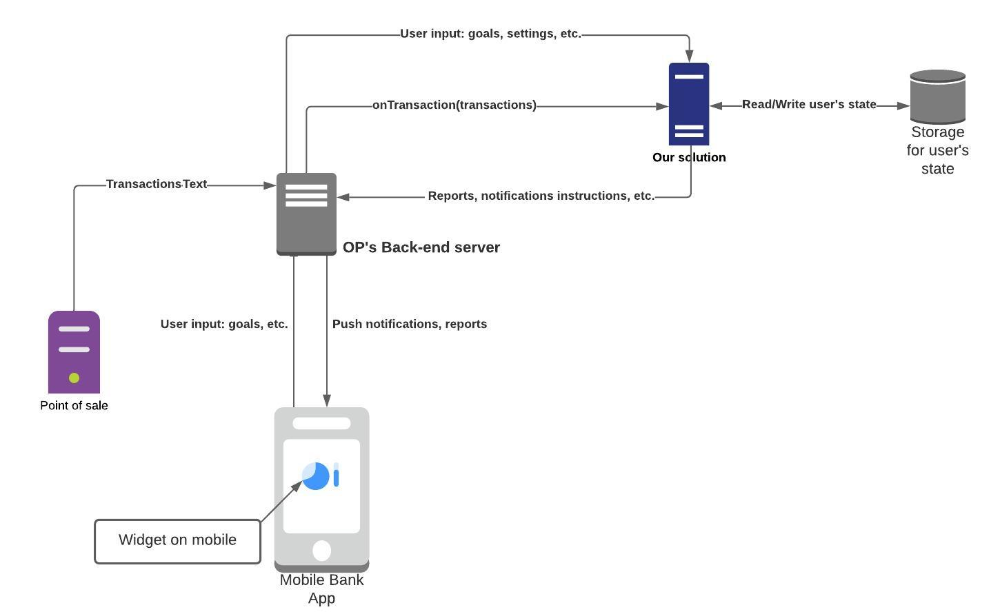

# Junction 2020

## Requirements

- node (at least version 14.3.0)

## Getting started

Install dependencies with:

```
npm install
```

Generate the initial state (including your initial goals) by running

```
node ./src/defaulter.js 5 1000
```

Replace 5 with an ID of the mock user (1 to 13 inclusive).
Replace 1000 with whatever you want your **initial spending limit** to be.

Run the following to produce a report based on the recent transactions and the list of goals defined in `data/state5.js` (again 5 is just an example)

```
node ./src/main.js 5
```

The output you see is a tailored collection of data specific to the mock user specified. Included you should see the monthly expenditure report, suggestions for the customer to work towards their goals, the actual goal expenditure to actual expenditure ratios, the alerts for the customer applicable since the last transaction and also any achievements and rewards the customer has accumulated.

After each execution of `./src/main.js`, the state of the user is (potentially) updated and persisted to the `data/state${ID}.js` file. The persisted state includes the received awards, achievements and most importantly a list of goals for different spending categories **that can be modified by a user at any point**.

## Architecture



## Concept

We have established through interviews that mobile banking customers have a wide range of requirements for what they would like to have as a mobile service. However, although the requirements domain was large, a common overlap which appeared in most interviews is the large discrepancy between what proportion of their income the customers' think they allocate to a specific category of expenditure, compared to what they actually allocate to the said category. We set out to use the transactional data provided by OP to develop a solution to aid the customer in understanding the proportional expenditure and allocation of their funds.

In order to achieve this, we knew we would need to find ways to encourage certain behaviour that either we, or the customer themselves deem desirable, and we chose to do this with a simple goal and reward mechanism. Empirical evidence shows that a user needs to be incentivised to complete a certain task, and if incentivised sufficiently, they will strive to achieve the task. Armed with this information we found a way to leverage the transactional data to build an understanding of the customer's expenditure and allocation habits, and given their goals, award them with achievements and rewards.

Architecturally, the system is very simple, with our solution being a simple function which is run when a new transaction takes place for the customer. The input to the function is the transactional history of the customer and any existing state for the customer, failing which a default state will be generated based on the customer's transactional history. The state is what stores the customer's goals, rewards, alerts, reports and achievements, and is all generated by our solution given the transactional history.

In terms of value, this solution will provide a means to incentivise the customer to direct their funds to more financially beneficial allocations, including directing funds to their OP investment and savings accounts. Our solution achieves this by exposing an API with the needed data for the client system, envisioned as a mobile app or widget, which will then be able to display the information to the user.

In summary, our solution focuses on the algorithm which runs when a new transaction takes place for a customer. Given the customer transaction history, the algorithm will produce data which can be used by the client application, such as the mobile app or widget. This data includes the customer specific alerts, rewards, suggestions, reports and achievements all tailored to the customer's specific goals and financial behaviour.


